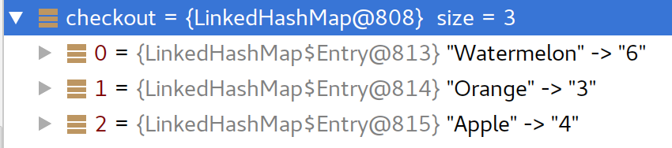

## A Simple Java and Clojure Code Comparison Example

In the initial stage of a job application I was asked to code up a problem, specifically in Java. Here's the spec:

> Recruitment Code Submission
> 
> ## Please write a program to represent the following scenario:
> 
> We are a national supermarket chain that is interested in starting to use special offers in our stores.
> We stock the following products:
> 
> | Item       | Price (£) |
> |------------|----------:|
> | Apple      | 0.20      |
> | Orange     | 0.50      |
> | Watermelon | 0.80      |
> 
> We would like to allow the following special offers:
> * Buy One Get One Free on Apples
> * Three For The Price Of Two on Watermelons
> 
> We would like to see the output for an example basket containing the following items:
> 
> | Item        | Quantity |
> |-------------|---------:|
> | Apple       | 4        |
> | Orange      | 3        |
> | Watermelon  | 6        |
> 
> ## Notes
> * There is no requirement for a user interface
> * Please use java as this is a mainly java based role.
> * Just zip up the submission and email it directly to us.

OK - sounds straightforward enough. Sometimes you see "must know lambda expressions" and such like, and I've not written much functional stuff in Java. With a decent amount of Clojure under my belt this seemed like an opportunity to play with functional code in Java. It would also be an opportunity to compare a solution in the two languages. Note, this example uses Java 8.

This example assumes you are on the first rung of the Clojure ladder - you have Clojure and Leiningen and played with the REPL, and that you've played with functional Java.

## Solution

Assumptions:

* Items could pass through the "checkout" in any order, so we would need to group them up to know how to apply the offer.
* An offer is a function that accepts a quantity and unit price and returns an amount by which the total for that item is then discounted

### Java

How does this look in funtional Java?

#### Offer Functional Interface

To use Java's lambda expressions there must be a functional interface to declare the method, arguments and return value. There are many such interfaces available in the JDK but I've declared my own here, for illustrative purposes and because I have used a combination of primitive types.

```java
@FunctionalInterface
public interface OfferF
{
  public double applyOffer(long qty, double unitPrice);
}
```
#### Offer Functions

Next, the offer functions themselves. As a way to collect them, I decided to define an `enum` like this

```java
public enum Offer
{
  NONE ("", (long qty, double price) -> 0), // No offer
  BOGOF ("BOGOF", (long qty, double price) -> (qty / 2 + qty % 2 - qty) * price),
  THREEFORTWO ("Three for Two", (long qty, double price) -> (qty / 3 * 2 + qty % 3 - qty) * price);

  public final String offerName;
  public final OfferF offerF;

  Offer(String name, OfferF offerF) {
    this.offerName = name;
    this.offerF = offerF;
  }

  @Override
  public String toString()
  {
    return offerName;
  }
}

```
Possibly, because Java 8 has no convenient literal map syntax unlike Clojure, some of these "custom tuple" type classes will exist in Java functional style. In this example there are also `Item` and `ReceiptEntry` in a similar vein.

#### Grouping Purchased Items

The first thing to do is group the purchased items, so we know how many of each there are. The function `checkoutQtys` in [Main.java](https://github.com/inqwell/supermarket/blob/master/supermarketjava/src/main/java/com/supermarket/Main.java#L41), specifically
```java
items.stream()
            .collect(Collectors.groupingBy(Item::getName, LinkedHashMap<String, Long> ::new, Collectors.counting()));
```
For our list of items, this is the result


#### Generating The Receipt Entries

Next, `generateReceipt` works out the total for each distinct item and any offer discount
```java
qtys.entrySet().stream()
            .map(entry -> {Item item = inventory.get(entry.getKey());
                           return new ReceiptEntry(item,
                                                   entry.getValue(),
                                                   item.offer.offerF.applyOffer(entry.getValue(),item.price));})
            .collect(Collectors.toList());
```
This makes a list of `ReceiptEntry`s which looks like this:


#### Printing The Receipt

Finally, we print the receipt with this code:
```java
    System.out.println("\nSUPERMARKET plc\n");

    // This is a bit hacky - the idea is to process the items sequence only
    // once, printing each item and making the total as we go.
    double total = items.stream()
            .mapToDouble(entry ->
            {
              System.out.printf("%-12s x%d    %.2f\n", entry.item.name, entry.qty, entry.price);
              if (entry.offer != 0)
                System.out.printf("           %-15s %.2f\n", entry.item.offer.offerName, entry.offer);
              return entry.price + entry.offer;
            })
            .sum();
    System.out.printf("\nTOTAL     %.2f\n", total);
    System.out.println("\nThank you for shopping with us");
```
There are a few things wrong with this:
* we're using a `stream` (in Clojure terms, a `sequence`) to loop over the items; printing them is a _side effect_ of this code, something that is generally frowned upon;
* at the same time we're returning the sum of the total and offer of each `ReceiptEntry`
so overall, this code is doing too much. A simple loop would suffice and we don't need functional wizardry here. More on this when we look at the Clojure version

### Clojure

Let's have a look at the Clojure version.

It's fair to say that equivalent functionality in Clojure will take some fraction of LOC required in Java. The first thing we see is there is only one source file, [core.clj](https://github.com/inqwell/supermarket/blob/master/supermarketclj/src/supermarketclj/core.clj).

#### Offer Functions

The `make-item` and `make-offer` Clojure functions are used to set up the stock "database" like this:
```Clojure
(def inventory {:apple (make-item "Apple" 0.2 (make-offer "BOGOF"
                                                          (fn [qty price]
                                                            (-> (int (/ qty 2))
                                                                (+ (mod qty 2))
                                                                (- qty)
                                                                (* price)))))
                :orange (make-item "Orange" 0.5 (make-offer "NONE" (constantly 0)))
                :watermelon (make-item "Watermelon" 0.8 (make-offer "Three for Two"
                                                                    (fn [qty price] (-> (int (/ qty 3))
                                                                            (* 2)
                                                                            (+ (mod qty 3))
                                                                            (- qty)
                                                                            (* price)))))})
```
Because Clojure promotes the use of maps rather than types, and has a literal map syntax to make this easy, there are no "custom tuple" entities we saw in the Java example.

#### Grouping Purchased Items
Here is the function that generates the receipt:
```Clojure
(defn make-basket
  "Create the basket from an arbitrary list of items.
  Groups the items together to determine how many of each there are,
  then makes a receipt entry for each grouping."
  [shopping-items]
  (->> (group-by :name shopping-items)
       (map (fn [[name item-list]]
              (make-receipt-entry (first item-list)
                                  (count item-list))))))
```
This doing the grouping and making the receipt entries as separate steps. Because the global var and argument are both called `shopping-items` there is a symbol in scope that means we can just run the `group-by` form by sending it to our REPL:

```Clojure
supermarketclj.core=> (group-by :name shopping-items)
{"Watermelon" [{:name "Watermelon",
                :price 0.8,
                :offer {:name "Three for Two",
                        :offer-fn #object[supermarketclj.core$fn__27 0x669ca605 "supermarketclj.core$fn__27@669ca605"]}}
               {:name "Watermelon",
                :price 0.8,
                :offer {:name "Three for Two",
                        :offer-fn #object[supermarketclj.core$fn__27 0x669ca605 "supermarketclj.core$fn__27@669ca605"]}}
               {:name "Watermelon",
                :price 0.8,
                :offer {:name "Three for Two",
                        :offer-fn #object[supermarketclj.core$fn__27 0x669ca605 "supermarketclj.core$fn__27@669ca605"]}}
               {:name "Watermelon",
                :price 0.8,
                :offer {:name "Three for Two",
                        :offer-fn #object[supermarketclj.core$fn__27 0x669ca605 "supermarketclj.core$fn__27@669ca605"]}}
               {:name "Watermelon",
                :price 0.8,
                :offer {:name "Three for Two",
                        :offer-fn #object[supermarketclj.core$fn__27 0x669ca605 "supermarketclj.core$fn__27@669ca605"]}}
               {:name "Watermelon",
                :price 0.8,
                :offer {:name "Three for Two",
                        :offer-fn #object[supermarketclj.core$fn__27 0x669ca605 "supermarketclj.core$fn__27@669ca605"]}}],
 "Orange" [{:name "Orange",
            :price 0.5,
            :offer {:name "NONE",
                    :offer-fn #object[clojure.core$constantly$fn__4614
                                      0x617d1284
                                      "clojure.core$constantly$fn__4614@617d1284"]}}
           {:name "Orange",
            :price 0.5,
            :offer {:name "NONE",
                    :offer-fn #object[clojure.core$constantly$fn__4614
                                      0x617d1284
                                      "clojure.core$constantly$fn__4614@617d1284"]}}
           {:name "Orange",
            :price 0.5,
            :offer {:name "NONE",
                    :offer-fn #object[clojure.core$constantly$fn__4614
                                      0x617d1284
                                      "clojure.core$constantly$fn__4614@617d1284"]}}],
 "Apple" [{:name "Apple",
           :price 0.2,
           :offer {:name "BOGOF",
                   :offer-fn #object[supermarketclj.core$fn__25 0x7483e53b "supermarketclj.core$fn__25@7483e53b"]}}
          {:name "Apple",
           :price 0.2,
           :offer {:name "BOGOF",
                   :offer-fn #object[supermarketclj.core$fn__25 0x7483e53b "supermarketclj.core$fn__25@7483e53b"]}}
          {:name "Apple",
           :price 0.2,
           :offer {:name "BOGOF",
                   :offer-fn #object[supermarketclj.core$fn__25 0x7483e53b "supermarketclj.core$fn__25@7483e53b"]}}
          {:name "Apple",
           :price 0.2,
           :offer {:name "BOGOF",
                   :offer-fn #object[supermarketclj.core$fn__25 0x7483e53b "supermarketclj.core$fn__25@7483e53b"]}}]}
supermarketclj.core=> 
```

The `:name` element of each item is the grouping value and `group-by` returns a hash map of distinct names to an array of items with that name. This is a different structure to the Java example, but serves the purpose just as well.

#### Generating The Receipt Entries

The grouped items (the result of the `group-by` form) are threaded as the last argument to the following `(map ...)` form. Because this is a hash map, each element of the sequence passed to the map function is an array of two elements, the key and the value. We can _destructure_ these into individual arguments by expressing the single argument to the map function itself as an array. Unused arguments to functions are traditionally expressed with the placeholder `_`. In this case I have called it `name_` for clarity.

Here is the output of `make-basket` when invoked from the REPL:

```Clojure
supermarketclj.core=> (make-basket shopping-items)
({:item {:name "Watermelon",
         :price 0.8,
         :offer {:name "Three for Two",
                 :offer-fn #object[supermarketclj.core$fn__27 0x669ca605 "supermarketclj.core$fn__27@669ca605"]}},
  :qty 6,
  :price 4.800000000000001,
  :offer -1.6}
 {:item {:name "Orange",
         :price 0.5,
         :offer {:name "NONE",
                 :offer-fn #object[clojure.core$constantly$fn__4614
                                   0x617d1284
                                   "clojure.core$constantly$fn__4614@617d1284"]}},
  :qty 3,
  :price 1.5,
  :offer 0}
 {:item {:name "Apple",
         :price 0.2,
         :offer {:name "BOGOF",
                 :offer-fn #object[supermarketclj.core$fn__25 0x7483e53b "supermarketclj.core$fn__25@7483e53b"]}},
  :qty 4,
  :price 0.8,
  :offer -0.4})
```
with all the information we need in the structure to print the receipt.

#### Printing The Receipt

Here is the code to print the receipt; there are two functions
```Clojure
(defn print-totals
  [[total discount-total]]
  (print (format "\nTOTAL     %.2f\n" total))
  (when-not (zero? discount-total)
    (do
      (print (format "\nOFFERS   %.2f\n" discount-total))
      (print (format "\n          %.2f\n" (+ total discount-total)))))
    (println "\nThank you for shopping with us"))


(defn print-receipt
  [basket]
  (println "\nSUPERMARKET plc\n")
  (print-totals
    (loop [total          0
           total-discount 0
           basket         basket]
      (if (seq basket)
        (let [entry (first basket)]
          (print-receipt-entry entry)
          (recur (+ total (:price entry))
                 (+ total-discount (:offer entry))
                 (rest basket)))
        [total total-discount]))))
```
In this case a looping construct has been used to print the items and return the totals. In a similar way to arguments, the return value of the loop is an array of the total and discount total. This is passed to `print-totals` as a single argument which is deconstructed by the argument declaration of `[[total discount-total]]`.

### Summary

In trying to compare Java written in a functional way with Clojure, this example highlights two contrasts:
1. Being a typed language, you will continue to define classes to represent domain entities; in this example these only represent data.
2. Being untyped will lead to cleaner and more frequent reuse of your functional code. In the typed case, special effort via generics usage will be required to achieve the same reuse.

These examples can be run as:

* Java - `$ gradle run`
* Clojure - `$ lein run`

Here's the output:
```
SUPERMARKET plc

Watermelon   x6    4.80
           Three for Two   -1.60
Orange       x3    1.50
Apple        x4    0.80
           BOGOF           -0.40

TOTAL     7.10

OFFERS   -2.00

          5.10
```
